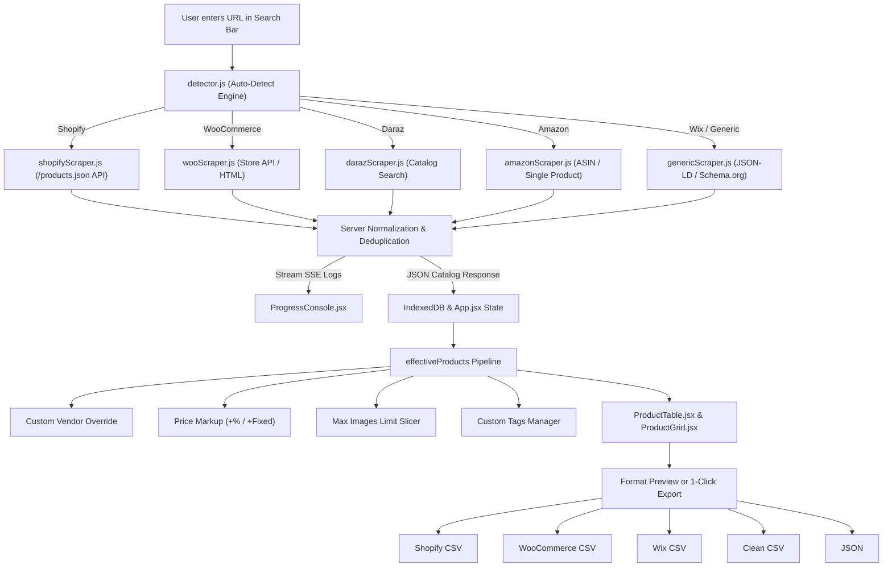

# 📦 getProducts — Universal E-Commerce Scraper & Multi-Platform CSV Exporter

[](https://reactjs.org/)
[](https://vitejs.dev/)
[](https://tailwindcss.com/)
[](https://nodejs.org/)
[](https://expressjs.com/)
[](https://opensource.org/licenses/MIT)

> **getProducts** is a high-performance, full-stack e-commerce catalog extraction and transformation platform. It allows users to paste any online store URL (Shopify, WooCommerce, Wix, Daraz, Zatiq, Amazon, or custom HTML5 stores) and instantly scrape, clean, enrich, and export products into ready-to-import CSV formats for **Shopify**, **WooCommerce**, **Wix**, **Universal Clean CSV**, or **Structured JSON**.

---

## 🌟 Key Features

* **⚡ Universal Auto-Detection Engine:** Automatically identifies whether a target URL is Shopify, WooCommerce, Wix, Daraz, Zatiq, Amazon, or generic HTML/Schema.org microdata.
* **📡 Real-Time SSE Streaming Logs:** Server-Sent Events (SSE) stream terminal logs live to the browser with zero polling lag.
* **📈 Price Markup & Profit Margin Calculator:** Apply instant profit margins (+10%, +20%, or fixed +$5, +$10) across the entire catalog or selected products.
* **🖼️ Max Image Slicer:** Cap the number of exported high-res gallery images per product (e.g., 1, 3, 5, or all photos).
* **🏷️ Bulk Tag Manager & Inline Editing:** Non-destructively add new tags or selectively remove existing tags across chosen items.
* **🔍 Find & Replace Tool:** Batch replace brand names, supplier titles, and links across titles, descriptions, and vendors with regex support.
* **📦 Multi-Platform Native CSV Exporters:**
  * **Shopify CSV:** Multi-row variant expansion, image position mapping, SKU generation, and HTML description formatting.
  * **WooCommerce CSV:** Attribute variation formatting, stock statuses, categories, and pipe-delimited image galleries.
  * **Wix Store CSV:** Wix product field mappings and ribbon/tag metadata.
  * **Universal Clean CSV & JSON:** Normalized flat catalog suitable for Excel, Google Sheets, or custom database ingestion.
* **💾 Persistent IndexedDB Storage:** Automatically saves extracted catalogs in the browser so data is never lost on refresh.
* **☀️ Dark & Cream Light Mode:** High-contrast, accessibility-compliant theme switcher with instant preference saving.

---

## 🛠️ Technology Stack & Architectural Decisions

| Layer | Technology | Why It Was Chosen |
| :--- | :--- | :--- |
| **Frontend Framework** | **React 19** | Ultra-responsive state management, seamless component lifecycle, and modern hooks. |
| **Build Tool** | **Vite 8 (Rolldown / Oxc)** | Sub-second HMR in development and lightning-fast ~200ms production builds. |
| **Styling Engine** | **TailwindCSS v4** | Pure utility-first CSS design system with minimal bundle footprint (~10KB gzip). |
| **Icons & UI** | **Lucide React & React Icons** | Lightweight SVG icons with tree-shaking support and high visual polish. |
| **Client Database** | **IndexedDB (`idb-keyval`)** | Stores thousands of scraped products locally without hitting `localStorage` 5MB quota. |
| **Backend Runtime** | **Node.js & Express** | Lightweight, event-driven async I/O perfect for concurrent web scraping pipelines. |
| **HTML Parser** | **Cheerio** | Blazing-fast DOM/AST manipulation without the heavy memory overhead of full headless browsers. |
| **HTTP Client** | **Axios with Header Rotation** | Emulates realistic Chrome and Safari browser headers to bypass basic bot rate-limits. |
| **Live Streaming** | **Server-Sent Events (SSE)** | Unidirectional, lightweight streaming for live terminal logs without WebSocket complexity. |

---

## 📂 Project Structure & File Directory Map

```text
products-csv-downloader/
├── client/                             # Frontend React + Vite Application
│   ├── public/
│   │   ├── favicon.svg                 # Brand icon asset
│   │   ├── icons.svg                   # Platform logo symbols
│   │   └── robots.txt                  # Search engine bot directives
│   ├── src/
│   │   ├── components/                 # UI Components
│   │   │   ├── AboutPage.jsx           # Mission statement, technology showcase & roadmap
│   │   │   ├── AdSlot.jsx              # Responsive ad slot & partner promotion banner
│   │   │   ├── BrandSlider.jsx         # Infinite marquee slider of supported platforms
│   │   │   ├── BulkTagModal.jsx        # Modal for bulk adding & removing product tags
│   │   │   ├── ContactPage.jsx         # Developer contact details & feedback form
│   │   │   ├── ExportDrawer.jsx        # Single-row toolbar (Markup, Stock, Vendor, Images, Export cards)
│   │   │   ├── FindReplaceModal.jsx    # Live catalog search & replace tool with match counter
│   │   │   ├── Footer.jsx              # Fair use disclaimer, legal pillars & author links
│   │   │   ├── FormatPreviewModal.jsx  # Live spreadsheet/code preview before downloading CSV
│   │   │   ├── Header.jsx              # Brand logo, page tabs, trial indicator & theme toggle
│   │   │   ├── PricingPage.jsx         # Tiered pricing plans ($0, $3, $7, $15) with confetti trial activation
│   │   │   ├── ProductGrid.jsx         # Responsive card-grid view for extracted products
│   │   │   ├── ProductImage.jsx        # Lazy-loading image component with fallback placeholder
│   │   │   ├── ProductTable.jsx        # Excel-like spreadsheet table with bulk selection & inline edits
│   │   │   ├── ProgressConsole.jsx     # Live terminal log console with internal auto-scroll
│   │   │   ├── StatsBar.jsx            # KPI cards (Total Products, Variants, Price Range, Images)
│   │   │   └── UrlBar.jsx              # Hero section, typewriter search bar, limit & engine selectors
│   │   ├── utils/
│   │   │   └── storage.js              # IndexedDB abstraction layer for persistent local caching
│   │   ├── App.jsx                     # Root application coordinator & data pipeline
│   │   ├── index.css                   # Global Tailwind v4 styles, custom fonts & scrollbars
│   │   └── main.jsx                    # React DOM entry point
│   ├── index.html                      # SEO-optimized HTML template with non-blocking fonts
│   ├── package.json                    # Client dependencies & build scripts
│   └── vite.config.js                  # Vite bundler configuration & backend API proxy
│
├── server/                             # Backend Node.js + Express API
│   ├── scrapers/                       # Extraction Engines
│   │   ├── amazonScraper.js            # Amazon single product & ASIN parser
│   │   ├── darazScraper.js             # Daraz & Lazada marketplace multi-page crawler
│   │   ├── detector.js                 # Heuristic e-commerce platform detection engine
│   │   ├── genericScraper.js           # Universal Schema.org JSON-LD & OpenGraph crawler
│   │   ├── index.js                    # Unified scraper router & normalizer
│   │   ├── shopifyScraper.js           # Shopify high-speed JSON catalog & single product extractor
│   │   ├── wooScraper.js               # WooCommerce Store API, REST, & HTML scraper
│   │   └── zatiqScraper.js             # Zatiq / EasyBill inventory API extractor
│   │
│   ├── exporters/                      # File Generation & Formatting
│   │   ├── jsonFormatter.js            # Standard and Shopify native JSON formatter
│   │   ├── shopifyFormatter.js         # Official Shopify CSV multi-row format generator
│   │   ├── universalFormatter.js       # Clean Universal flat CSV generator
│   │   ├── wixFormatter.js             # Wix eCommerce CSV schema formatter
│   │   └── wooFormatter.js             # WooCommerce product importer CSV generator
│   │
│   ├── index.js                        # Express server entry point, SSE streams & export endpoints
│   └── package.json                    # Server dependencies
│
├── .gitignore                          # Git ignore rules
├── nixpacks.toml                       # Railway deployment build configuration
├── package.json                        # Monorepo root scripts
├── railway.toml                        # Railway orchestration configuration
└── README.md                           # Documentation & architecture guide
```

---

## 🔄 Core Data Pipeline & Business Logic



---

## 🚀 Getting Started Locally

### Prerequisites
* **Node.js**: v18.0.0 or higher
* **npm**: v9.0.0 or higher

### 1. Clone the repository
```bash
git clone https://github.com/nokib-web/scraper_csv.git
cd scraper_csv
```

### 2. Install dependencies
```bash
# Install root dependencies
npm install

# Install server dependencies
cd server && npm install

# Install client dependencies
cd ../client && npm install
cd ..
```

### 3. Start Development Server
```bash
# Run backend and frontend concurrently
npm run dev
```
* **Frontend:** `http://localhost:5173`
* **Backend API:** `http://localhost:4000`

---

## 🌐 Production Deployment (Railway / Cloud)

This project includes pre-configured `railway.toml` and `nixpacks.toml` files:
1. Link your GitHub repository to [Railway](https://railway.app/).
2. The root `package.json` will automatically build the React frontend and launch the Node.js server.
3. The Express server serves the production client from `client/dist` and handles all `/api/*` routes.

---

## 👨‍💻 Author & Credits

* **Developer:** [Nazmul Hasan Nokib](https://nokib.vercel.app/developer)
* **GitHub:** [@nokib-web](https://github.com/nokib-web)
* **Portfolio:** [nokib.vercel.app](https://nokib.vercel.app)

---

## ⚖️ Disclaimer & Fair Use

This software is developed strictly for **market research, competitor price analysis, and academic/development testing**. Users are responsible for complying with the terms of service of the target websites they scrape.
