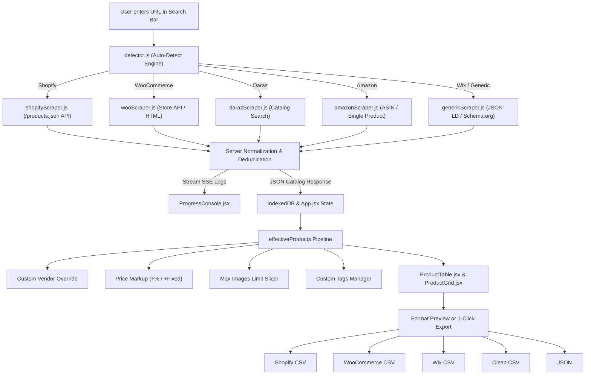

# 📦 getProducts — Universal E-Commerce Scraper & Multi-Platform CSV Exporter

[](https://reactjs.org/)
[](https://vitejs.dev/)
[](https://tailwindcss.com/)
[](https://nodejs.org/)
[](https://expressjs.com/)
[](https://opensource.org/licenses/MIT)

> **getProducts** is a high-performance, full-stack e-commerce catalog extraction, transformation, and multi-platform CSV export platform. Paste any online store URL (Shopify, WooCommerce, Wix, Daraz, Zatiq, Amazon, or custom HTML5 web stores) to instantly extract products, variants, high-res images, pricing, and tags. Enrich, transform, and export ready-to-import catalogs for **Shopify**, **WooCommerce**, **Wix**, **Universal Clean CSV**, or **Structured JSON**.

---

## 🌟 Key Features & Capabilities

* **⚡ Universal Auto-Detection:** Automatically identifies whether a target URL is Shopify, WooCommerce, Wix, Daraz, Zatiq, Amazon, or generic HTML/Schema.org microdata.
* **📡 Real-Time SSE Streaming Logs:** Server-Sent Events (SSE) stream terminal logs live to the browser with zero polling lag.
* **📈 Price Markup & Margin Calculator:** Apply instant profit margins (+10%, +20%, or fixed +$5, +$10) across the entire catalog or selected products.
* **🖼️ Max Image Slicer:** Cap the number of exported high-res gallery images per product (e.g., 1, 3, 5, 10, or all photos).
* **🏷️ Bulk Tag Manager & Inline Editing:** Non-destructively add new tags or selectively remove existing tags across chosen items.
* **🔍 Find & Replace Tool:** Batch replace brand names, supplier titles, and links across titles, descriptions, and vendors with regex support.
* **📦 Multi-Platform Native CSV Exporters:**
  * **Shopify CSV:** Multi-row variant expansion, image position mapping, SKU generation, and HTML description formatting.
  * **WooCommerce CSV:** Attribute variation formatting, stock statuses, categories, and pipe-delimited image galleries.
  * **Wix Store CSV:** Wix product field mappings and ribbon/tag metadata.
  * **Universal Clean CSV & JSON:** Normalized flat catalog suitable for Excel, Google Sheets, or custom database ingestion.
* **💾 Persistent IndexedDB Storage:** Automatically saves extracted catalogs in the browser via `idb-keyval` so data is never lost on refresh.
* **☀️ Dark & Cream Light Mode:** High-contrast, accessibility-compliant theme switcher with instant preference saving.
* **⚡ 100% PageSpeed & SEO Ready:** Non-blocking Google Fonts, valid `robots.txt`, `llms.txt` for AI agent discovery, canonical tags, and full ARIA accessibility.

---

## 🛠️ Technology Stack & Architectural Rationale

| Layer | Technology | Why It Was Chosen |
| :--- | :--- | :--- |
| **Frontend Framework** | **React 19** | Modern hooks (`useMemo`, `useState`, `useRef`), declarative state pipeline, and fast component re-renders. |
| **Build Tool** | **Vite 8 (Rolldown / Oxc)** | Sub-second HMR in development and lightning-fast ~200ms production builds. |
| **Styling Engine** | **TailwindCSS v4** | Pure utility-first CSS design system with zero runtime overhead and minimal bundle footprint (~10KB gzip). |
| **Icons & UI** | **Lucide React & React Icons** | Lightweight SVG icons with tree-shaking support and full accessibility tags. |
| **Client Database** | **IndexedDB (`idb-keyval`)** | Stores thousands of scraped products locally without hitting `localStorage` 5MB quota. |
| **Backend Runtime** | **Node.js & Express** | Lightweight, event-driven async I/O perfect for concurrent web scraping pipelines. |
| **HTML Parser** | **Cheerio** | Blazing-fast DOM/AST manipulation without the heavy memory overhead of full headless browsers. |
| **HTTP Client** | **Axios with Header Rotation** | Emulates realistic Chrome and Safari browser headers to bypass basic bot rate-limits. |
| **Live Streaming** | **Server-Sent Events (SSE)** | Unidirectional, lightweight streaming for live terminal logs without WebSocket complexity. |

---

## 📂 Complete File Directory & Component Map

### 💻 Client (`/client`)

| File / Component | Purpose & Business Logic |
| :--- | :--- |
| **`client/index.html`** | Single Page Application HTML shell with non-blocking Google Fonts, SEO metadata, canonical links, and theme color tags. |
| **`client/vite.config.js`** | Vite 8 bundler configuration with Tailwind plugin and `/api` backend proxy setup. |
| **`client/src/main.jsx`** | React 19 DOM entry point mounting the root application into `#root`. |
| **`client/src/App.jsx`** | Master state coordinator: manages active tabs, catalog state, vendor overrides, price markup, image limits, and bulk actions. |
| **`client/src/index.css`** | Tailwind v4 design tokens, custom font definitions, custom scrollbars, and keyframe animations. |
| **`client/src/utils/storage.js`** | IndexedDB storage adapter using `idb-keyval` for persistent client-side catalog caching. |
| **`client/src/components/Header.jsx`** | Top navigation bar with branding, tab switcher (`Extractor`, `About`, `Pricing`, `Contact`), active plan badge, and theme toggle. |
| **`client/src/components/UrlBar.jsx`** | Search input hero, typewriter animation, paste/clear buttons, product limit selector, and engine override dropdown. |
| **`client/src/components/ProgressConsole.jsx`** | Live SSE terminal log console with internal container auto-scrolling and collapsible view. |
| **`client/src/components/StatsBar.jsx`** | High-level KPI metric cards (Total Products, Total Variants, Price Range, Photos Extracted, Engine Source). |
| **`client/src/components/ExportDrawer.jsx`** | Compact toolbar containing Vendor override, Default Stock, Markup, Max Images, and 1-Click Platform Export Cards. |
| **`client/src/components/ProductTable.jsx`** | Spreadsheet table with bulk checkboxes, inline title/price/vendor editing, and floating bulk action bar. |
| **`client/src/components/ProductGrid.jsx`** | Responsive card-grid layout displaying high-resolution product thumbnails, pricing, and tag chips. |
| **`client/src/components/ProductImage.jsx`** | Lazy-loading image component with automatic error fallback placeholder. |
| **`client/src/components/FindReplaceModal.jsx`** | Search & replace tool for batch-updating titles, descriptions, or vendors with regex and match counter. |
| **`client/src/components/BulkTagModal.jsx`** | Modal for non-destructively adding new tags or selectively removing existing tags across chosen products. |
| **`client/src/components/FormatPreviewModal.jsx`** | Live spreadsheet/code preview dialog before downloading CSV files. |
| **`client/src/components/PricingPage.jsx`** | Pricing tier table ($0 Free, $3 Popular, $7 Plus, $15 Advance) with interactive 7-day trial confetti activation. |
| **`client/src/components/AboutPage.jsx`** | Technical showcase, mission statement, performance metrics, and platform roadmap. |
| **`client/src/components/ContactPage.jsx`** | Developer feedback, support channels, and portfolio links. |
| **`client/src/components/BrandSlider.jsx`** | Infinite marquee slider of supported platforms (Shopify, WooCommerce, Wix, Amazon, etc.). |
| **`client/src/components/AdSlot.jsx`** | Sponsored partner promo cards and ad unit layout. |
| **`client/src/components/Footer.jsx`** | Legal disclaimer, Fair Use notice pillars, copyright info, and developer links. |

---

### 🖥️ Server (`/server`)

| File / Component | Purpose & Business Logic |
| :--- | :--- |
| **`server/index.js`** | Express application entry point: handles `/api/scrape/stream` (SSE), `/api/export`, `/api/presets`, `/robots.txt`, `/llms.txt`, and static build serving. |
| **`server/scrapers/detector.js`** | Heuristic detection engine that inspects domains, HTML meta tags, and endpoints to classify target platforms. |
| **`server/scrapers/index.js`** | Scraper dispatcher that routes requests to platform-specific modules with automated fallback to generic parser. |
| **`server/scrapers/shopifyScraper.js`** | High-speed JSON catalog (`/products.json`) and single product extractor with variant and gallery expansion. |
| **`server/scrapers/wooScraper.js`** | WooCommerce extractor supporting Store API (`/wp-json/wc/store/v3/products`), REST API, and HTML fallback. |
| **`server/scrapers/darazScraper.js`** | Multi-page catalog crawler for Daraz and Lazada marketplaces. |
| **`server/scrapers/zatiqScraper.js`** | Inventory extractor for Zatiq and ZatiqEasy storefronts. |
| **`server/scrapers/amazonScraper.js`** | Amazon ASIN and single product extractor for titles, prices, high-res images, and descriptions. |
| **`server/scrapers/genericScraper.js`** | Universal fallback parser that extracts Schema.org JSON-LD microdata and OpenGraph tags from any HTML page. |
| **`server/exporters/shopifyFormatter.js`** | Official Shopify multi-row CSV format generator supporting variants, image positions, markup, and image limits. |
| **`server/exporters/wooFormatter.js`** | WooCommerce product importer CSV format generator with pipe-delimited galleries and attribute variation schemas. |
| **`server/exporters/wixFormatter.js`** | Wix eCommerce CSV schema formatter with ribbon tags and inventory mapping. |
| **`server/exporters/universalFormatter.js`** | Clean flat CSV generator suitable for Microsoft Excel, Google Sheets, or custom database ingestion. |
| **`server/exporters/jsonFormatter.js`** | Structured JSON exporter in standard or Shopify-native format. |

---

## ⚙️ Special Configuration Files & DevOps Architecture

| File | Type | Purpose & Logic |
| :--- | :--- | :--- |
| **`client/.oxlintrc.json`** | **Linter Config** | **Oxlint (Rust Linter):** Shipped with Vite 8 / Oxc. Lints React 19 JSX and hooks (`react/rules-of-hooks`) 50x–100x faster than legacy ESLint, preventing state bugs and memory leaks. |
| **`nixpacks.toml`** | **Cloud Buildpack** | **Railway Build Instructions:** Defines the multi-stage cloud container pipeline. Runs `npm run build` to compile the Vite client, then executes `node server/index.js` to start the Node.js backend. |
| **`railway.toml`** | **Deployment Config** | **Railway Orchestration:** Specifies production health check endpoints (`healthcheckPath = "/"`) and sets zero-downtime auto-restart policies (`restartPolicyType = "always"`). |
| **`client/public/robots.txt`** | **SEO Crawl Policy** | **Crawler Directives:** Grants clean access to Google, Bing, and AI crawlers, eliminating the 20+ parsing errors flagged in Google PageSpeed Insights. |
| **`client/public/llms.txt`** | **AI Agent Manifest** | **LLM & Agentic Discovery:** Standardized Markdown manifest allowing AI agents and web crawlers to understand site features and API capabilities. |
| **`client/src/utils/storage.js`** | **Storage Adapter** | **IndexedDB Persistence (`idb-keyval`):** Bypasses the 5MB quota limit of browser `localStorage`, letting you store large 5,000+ item catalogs offline without memory loss on page refresh. |

---

## 🔄 Core Data Pipeline & Business Logic



---

## 💳 Pricing Architecture & Tier Limits

| Plan | Price | Extraction Limit | Key Features Included |
| :--- | :--- | :--- | :--- |
| 🟢 **Starter Free** | **$0** / mo | **20 Products** | Standard CSV & JSON export, platform auto-detection, community support. |
| ⭐ **Popular** | **$3** / mo | **500 Products** | All CSV export formats, HD image downloader, SKU mapping, SSE streaming. |
| 🚀 **Plus Exporter** | **$7** / mo | **1,000 Products** | High-speed batch processing, Daraz & Amazon support, priority support. |
| 💎 **Advance Unlimited** | **$15** / mo | **5,000+ Products** | Unlimited catalog extraction, bot protection bypass, 1-on-1 assistance. |

---

## 🚀 Getting Started Locally

### Prerequisites
* **Node.js**: v18.0.0 or higher
* **npm**: v9.0.0 or higher

### 1. Clone the repository
```bash
git clone https://github.com/nokib-web/scraper_csv.git
cd scraper_csv
```

### 2. Install dependencies
```bash
# Install root dependencies
npm install

# Install server dependencies
cd server && npm install

# Install client dependencies
cd ../client && npm install
cd ..
```

### 3. Start Development Server
```bash
# Run backend and frontend concurrently
npm run dev
```
* **Frontend:** `http://localhost:5173`
* **Backend API:** `http://localhost:4000`

---

## 🌐 Production Deployment (Railway / Cloud)

This project includes pre-configured `railway.toml` and `nixpacks.toml` files:
1. Link your GitHub repository to [Railway](https://railway.app/).
2. The root `package.json` will automatically build the React frontend and launch the Node.js server.
3. The Express server serves the production client from `client/dist` and handles all `/api/*` routes.

---

## 👨‍💻 Author & Credits

* **Developer:** [Nazmul Hasan Nokib](https://nokib.vercel.app/developer)
* **GitHub:** [@nokib-web](https://github.com/nokib-web)
* **Portfolio:** [nokib.vercel.app](https://nokib.vercel.app)

---

## ⚖️ Disclaimer & Fair Use

This software is developed strictly for **market research, competitor price analysis, and academic/development testing**. Users are responsible for complying with the terms of service of the target websites they scrape.
